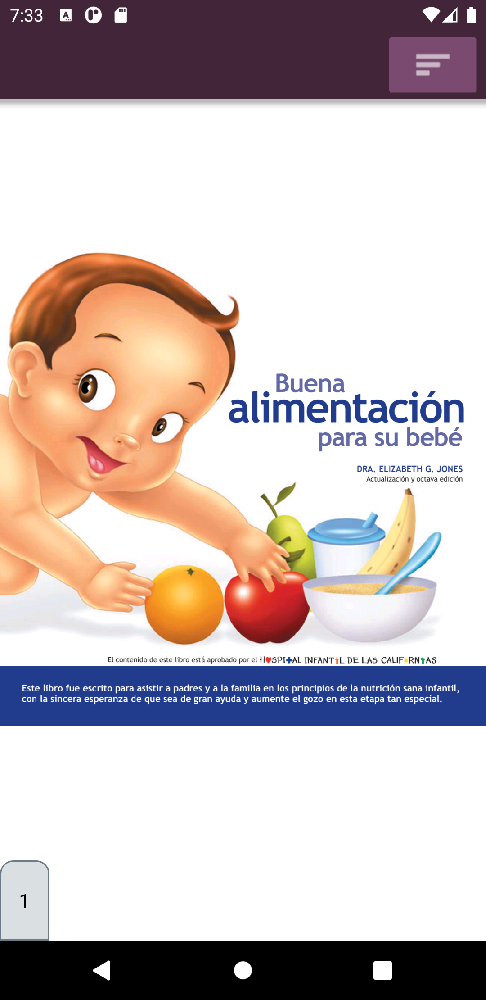
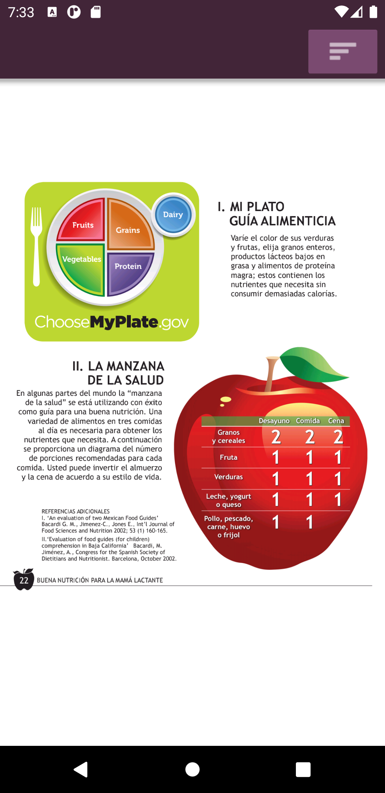
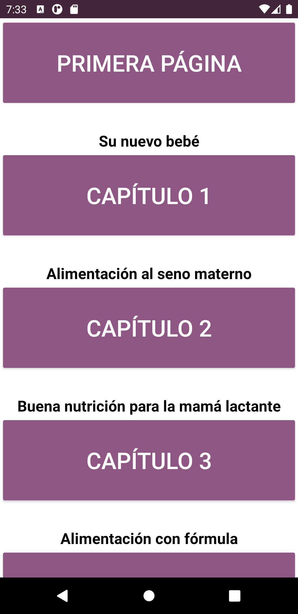
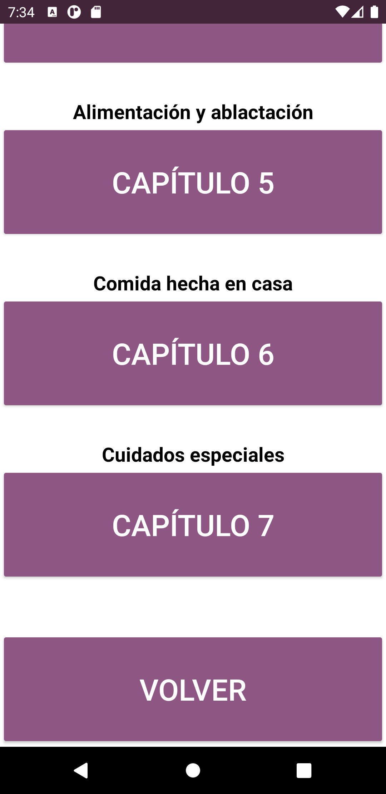
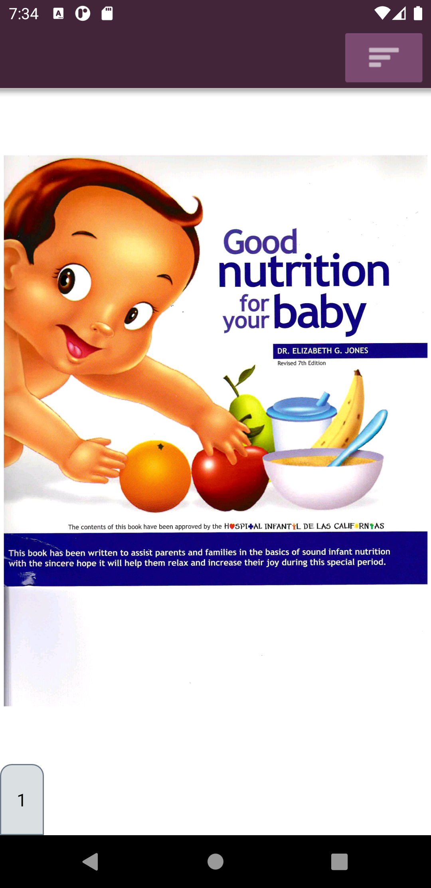
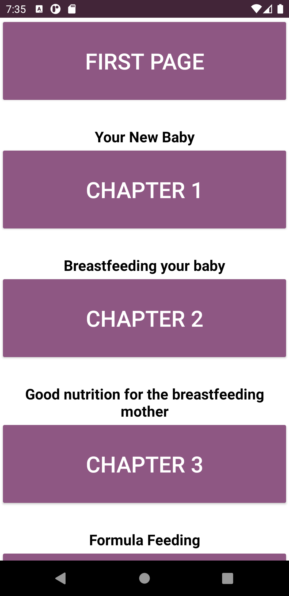
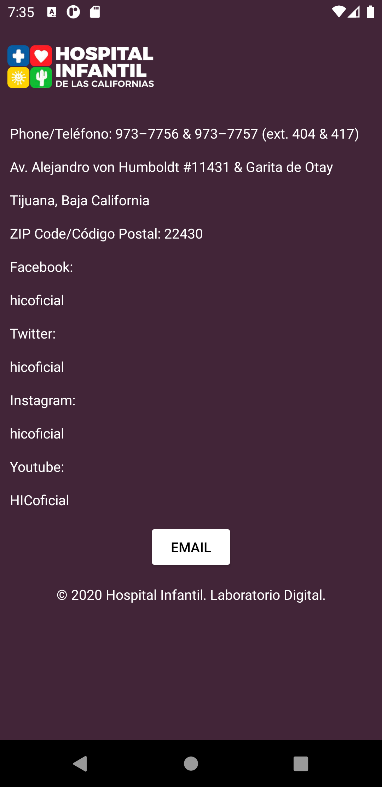

# Hospital Infantil de las Californias

## Tabla de Contenido
- [Información General](#información-general)
 - [Tecnologías](#tecnologías) 
- [Tutorial de la Aplicación](#tutorial-de-la-aplicación)
	* [Home](#home)
	* [Español](#español)
		+ [índice de capítulos español](#índice-de-capítulos-español)
	* [Inglés](#inglés)
		+ [índice de capítulos inglés](#índice-de-capítulos-inglés)
	* [Acerca De](#acerca-de)

## Información General
Este proyecto consiste en una aplicación móvil para leer libros (formato PDF) exclusivos del hospital, libros que estaran al alcance de los futuros padres brindando información segura y profesional sobre el cuidado de los infantes en sus primeros años de vida.

## Tecnologías 
* Android Studio.
* Bibliotecas auxiliares (https://github.com/barteksc/AndroidPdfViewerV1).

## Tutorial de la aplicación
## Home
Esta es la pantalla incial, en donde se observa un diseño minimalista con solo 3 botones.El primer botón es para acceder a el libro en el idioma español, el segundo botón es para acceder a el libro en el idioma inglés y el tercer botón es para coonsultar información y datos generales del hospital.

	

## Español
Aquí se presenta el libro en idioma español. Para cambiar de página solo basta deslizar la pestaña de color gris que se encuentra en la parte inferior de la pantalla, es esta misma se muestra el número de página actual. De igual manera se puede cambiar de página mediante taps en los costados derecho (página siguiente) e izquierdo (página anterior).

	
	

### Índice de capítulos español
Aquí se muestran los capítulos del libro para un fácil acceso, tmabién se agregaron los botones para acceder a la primera página y volver a la página actual.

	
	

## Inglés
Aquí se presenta el libro en idioma inglés. Para cambiar de página solo basta deslizar la pestaña de color gris que se encuentra en la parte inferior de la pantalla, es esta misma se muestra el número de página actual. De igual manera se puede cambiar de página mediante taps en los costados derecho (página siguiente) e izquierdo (página anterior).

	

### Índice de capítulos inglés
Aquí se muestran los capítulos del libro para un fácil acceso, tmabién se agregaron los botones para acceder a la primera página y volver a la página actual.

	

### Acerca de
Aquí se muestran datos informativos del Hosipital Infantil de las Californias y un botón para mandar mensajes vía correo electrónico.

	
	

