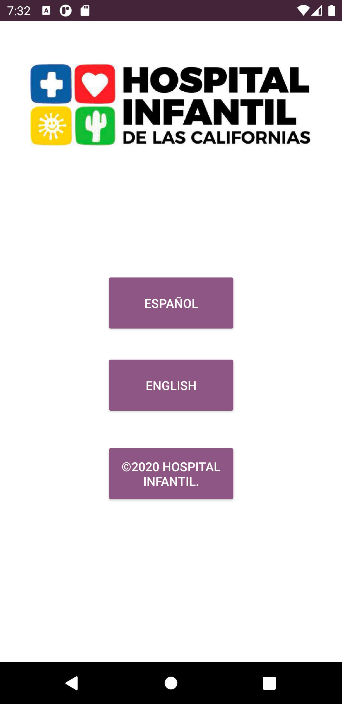

# Hospital Infantil de las Californias

## Tabla de Contenido
- [Información General](#información-general)
 - [Tecnologías](#tecnologías) 
- [Tutorial de la Aplicación](#tutorial-de-la-aplicación)
	* [Home](#home)
	* [Iniciar Sesión](#iniciar-sesión)
	* [Menu](#menu)
	* [Inicio](#inicio)
	* [Perfil](#perfil) 
		+ [Perfil de Usuario](#perfil-de-usuario)
		+ [Cambiar Contraseña](#cambiar-contraseña)
	* [Espacios](#espacios)
		+ [Mis Espacios](#mis-espacios)
		+ [Agregar Espacio](#agregar-espacio)
	* [Forestaciones](#forestaciones)
		+ [Mis Forestaciones](#mis-forestaciones)
		+ [Agregar Forestación](#agregar-forestación)
	* [Acerca De](#acerca-de)
	* [Cerrar Sesión](#cerrar-sesión)

## Información General
Este proyecto consiste en una aplicación móvil para leer libros (formato PDF) exclusivos del hospital, libros que estaran al alcance de los futuros padres brindando información segura y profesional sobre el cuidado de los infantes en sus primero años de vida.

## Tecnologías 
* Android Studio.
* Bibliotecas auxiliares (https://github.com/barteksc/AndroidPdfViewerV1).

## Tutorial de la aplicación
## Home
Esta es la pantalla incial, en donde se observa un diseño minimalista con solo 3 botones.El primer botón es para acceder a el libro en el idioma español, el segundo botón es para acceder a el libro en el idioma inglés y el tercer botón es para coonsultar información y datos generales del hospital.

	

